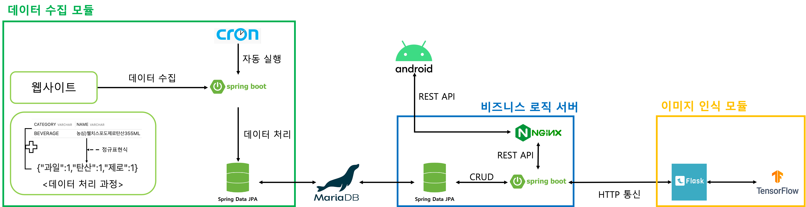

# 편의점 할인 정보 통합 조회 서비스 : 편킹

    💡 편의점마다 다른 수많은 행사 상품.. 어디서 사는게 가장 저렴할까? 편킹에서 찾아봐야지~!

## 핵심 기능

### 추천 상품 목록
    💡 서비스 사용자의 행동을 분석해 맞춤으로 추천 상품 목록을 제공합니다!
관련 이미지 스샷 (gif)
### 이미지 검색 기능(베타)
    💡 상품의 사진을 찍으면 해당 상품에 대한 할인 정보를 제공합니다!
관련 이미지 스샷 (gif)

## 시스템 아키텍처
### 전체 시스템 다이어그램

### 아티클
    서비스를 개발하면서 있었던 주요 이슈에 대해 정리한 글들입니다.
1. [추천 알고리즘 설계기](https://robinjoon.notion.site/81ea5ddd83f04e6eb81cdc16124c620f?pvs=4)
2. MariaDB JSON타입과 Spring Data JPA
3. 잘못된 추상화의 폐해
4. 상품 인식 모듈 성능 개선기
5. 데이터 크롤링 이슈
6. AWS 사용 실패기
